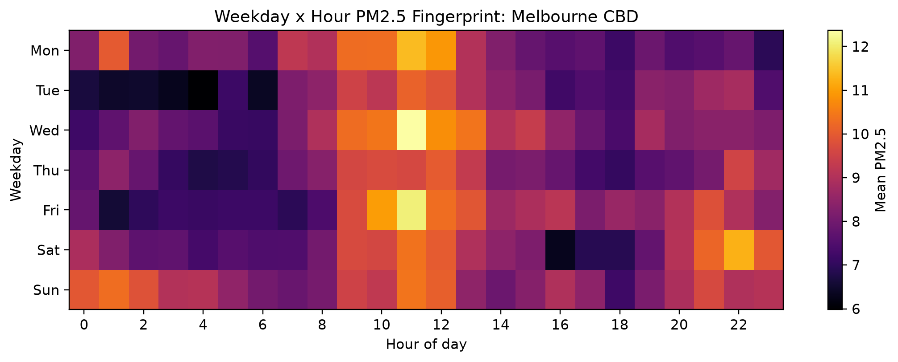
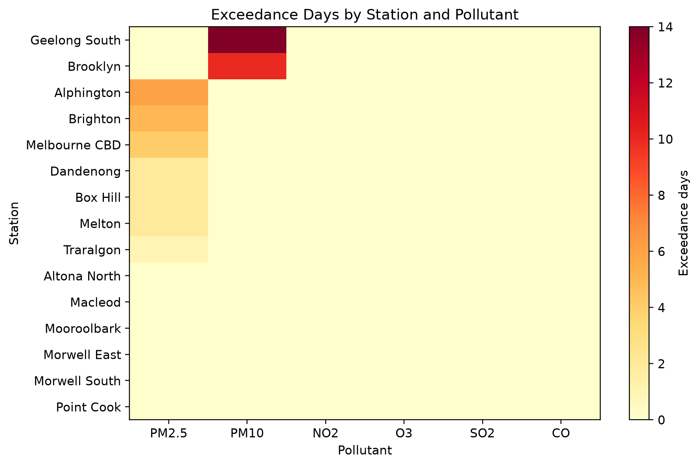

# Air Quality Analysis in Greater Melbourne


A Python-based data analysis project investigating air quality patterns across Greater Melbourne using publicly available environmental and socio-economic datasets.

The project integrates air quality observations from **EPA Victoria** with **ABS SEIFA** socio-economic indicators to perform data cleaning, temporal analysis, geospatial analysis, statistical analysis, visualisation, and automated report generation.

---

# Project Highlights

- Processed publicly available EPA Victoria air quality observations
- Integrated environmental and socio-economic datasets
- Estimated pollution exposure for SA2 regions
- Performed temporal and spatial analysis
- Generated publication-quality visualisations
- Produced automated PDF analytical reports
- Built an end-to-end reproducible data analysis pipeline

---

# Skills Demonstrated

This project demonstrates practical experience with:

- Python Programming
- Data Cleaning
- Data Wrangling
- Exploratory Data Analysis (EDA)
- Statistical Analysis
- Geospatial Analysis
- Data Visualisation
- Scientific Computing
- Automation
- Git & GitHub

---

# Technologies

- Python
- Pandas
- NumPy
- GeoPandas
- SciPy
- Matplotlib
- Seaborn
- OpenPyXL
- ReportLab

---

# Repository Structure

```text
.
├── code/
│   ├── 01_check_data.py
│   ├── 02_build_processed_data.py
│   ├── 03_make_figures.py
│   ├── 04_generate_pdfs.py
│   └── config.py
│
├── data/
│   ├── processed/
│   └── raw/                  (ignored in Git)
│
├── figures/
│
├── outputs/
│
├── report/
│   ├── report.tex
│   └── air_quality_report.pdf
│
├── requirements.txt
└── README.md
```

---

# Data Sources

The project uses three publicly available datasets.

### EPA Victoria

Hourly Air Quality Data

Contains hourly observations of:

- PM2.5
- PM10
- NO₂
- O₃
- SO₂
- CO

### Australian Bureau of Statistics (ABS)

SEIFA 2021

Provides socio-economic indicators including:

- IRSD
- IRSAD
- IER
- IEO

### ABS ASGS Edition 3

SA2 Boundary Files

Used for spatial matching and pollution exposure estimation.

---

# Project Workflow

```text
Raw Datasets
      │
      ▼
Dataset Validation
      │
      ▼
Data Cleaning
      │
      ▼
Data Processing
      │
      ▼
Spatial Analysis
      │
      ▼
Statistical Analysis
      │
      ▼
Visualisation
      │
      ▼
Automated PDF Report
```

---

# Generated Outputs

## Processed datasets

The pipeline generates:

- Monthly pollutant summaries
- Daily PM2.5 statistics
- Weekday-hour pollution patterns
- Station summaries
- SA2 exposure estimates
- Correlation tables

---

## Figures

The project automatically generates six figures.

- Monthly PM2.5 Heatmap
- Daily PM2.5 Time Series
- Weekday-Hour PM2.5 Pattern
- Pollution Exceedance Heatmap
- SEIFA Correlation Heatmap
- PM2.5 vs IRSD Scatter Plot

---

# Example Visualisations

## Monthly PM2.5 Heatmap


---

## Daily PM2.5 Time Series


---

## Weekday-Hour PM2.5 Pattern



---

## Pollution Exceedance Heatmap



---

## SEIFA Correlation Heatmap


---

## PM2.5 vs IRSD


---

# Key Findings

The analysis demonstrates clear temporal and spatial variations in air pollution across Greater Melbourne.

The generated statistics and visualisations enable exploration of:

- Monthly pollution trends
- Daily pollution variation
- Weekday-hour pollution patterns
- Pollution exceedance frequency
- Regional pollution exposure
- Relationships between pollution and socio-economic indicators

---

# Installation

Clone the repository

```bash
git clone https://github.com/Xiyu628/air-quality-analysis.git
cd air-quality-analysis
```

Create a virtual environment

```bash
python3 -m venv .venv
source .venv/bin/activate
```

Install dependencies

```bash
pip install -r requirements.txt
```

Download the required datasets from the official data providers and place them into:

```text
data/raw/
```

Run the complete workflow

```bash
python code/01_check_data.py
python code/02_build_processed_data.py
python code/03_make_figures.py
python code/04_generate_pdfs.py
```

---

# Repository Contents

Included

- Python source code
- Processed datasets
- Visualisations
- Analytical report
- Documentation

Excluded

- Raw datasets
- Python virtual environment
- Temporary files

---

# Future Work

Potential improvements include:

- Interactive dashboard using Plotly or Dash
- Machine learning models for pollution prediction
- Time-series forecasting
- Advanced spatial interpolation
- Web application deployment

---

# Acknowledgements

This project uses publicly available datasets provided by:

- EPA Victoria
- Australian Bureau of Statistics (ABS)

The project is intended for educational and research purposes.

---

# Author

**Xiyu Hao**

Computer Science Student

UNSW Sydney

GitHub: https://github.com/Xiyu628

---

⭐ If you found this project useful, feel free to star this repository.