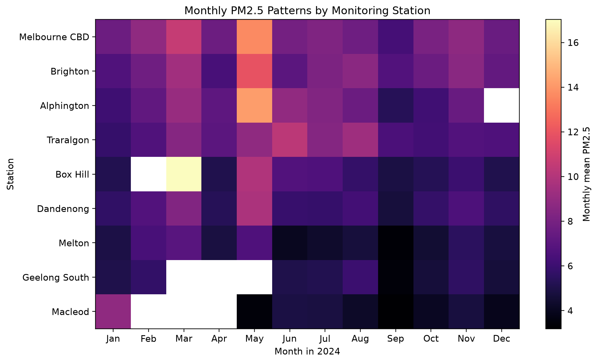
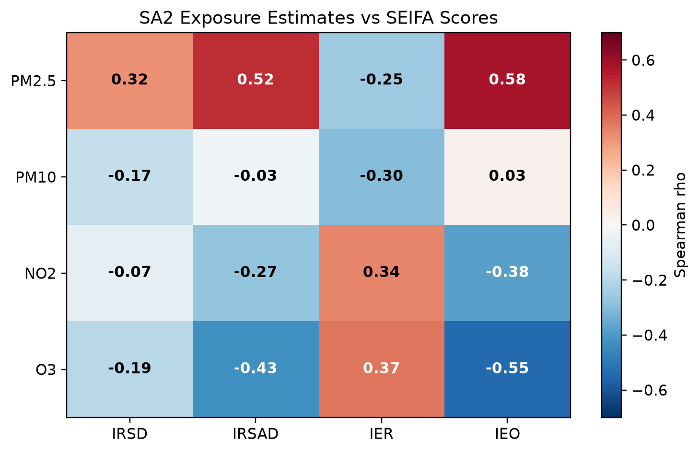
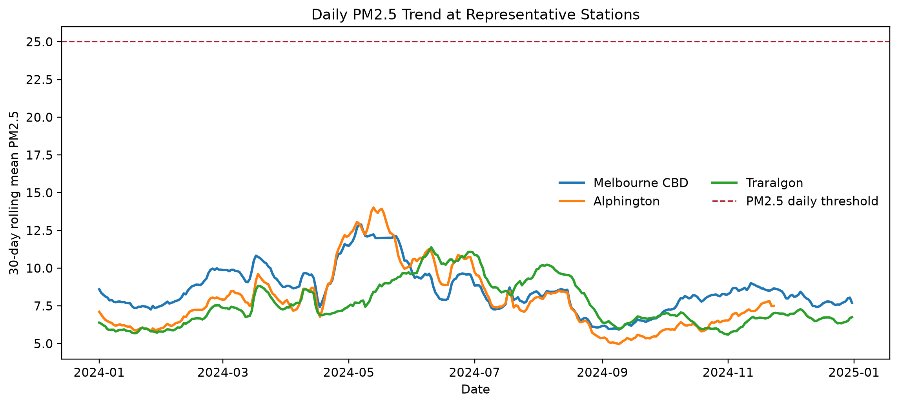
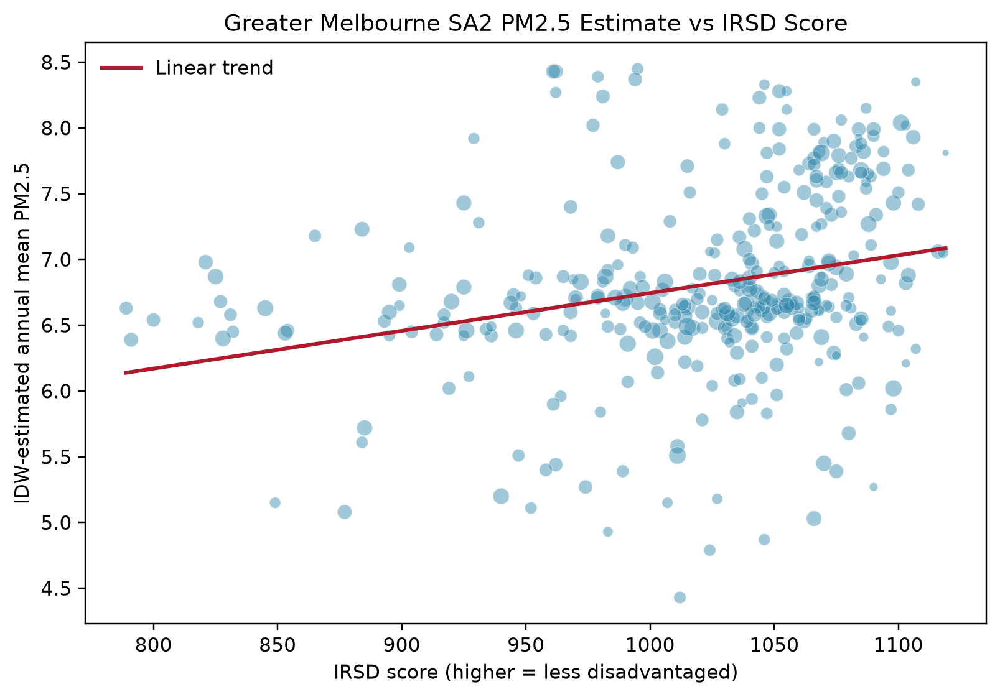

# Air Quality Analysis in Greater Melbourne


An end-to-end Python data analysis project investigating air quality patterns and socio-economic factors across Greater Melbourne using publicly available datasets from **EPA Victoria** and the **Australian Bureau of Statistics (ABS)**.

## Project Overview


This project builds a complete environmental data analysis pipeline, from validating raw datasets to producing publication-quality visualisations and analytical reports.

The workflow integrates environmental monitoring data with socio-economic indicators to explore pollution patterns across Greater Melbourne through statistical and geospatial analysis.

---

## Project Highlights

- Processed hourly air quality observations from EPA Victoria
- Integrated environmental and socio-economic datasets
- Estimated pollution exposure at SA2 level
- Performed temporal and geospatial analysis
- Generated publication-quality visualisations
- Produced automated PDF reports
- Built a fully reproducible Python workflow

---

## Skills Demonstrated

- Python Programming
- Data Cleaning
- Data Wrangling
- Exploratory Data Analysis (EDA)
- Statistical Analysis
- Geospatial Analysis
- Data Visualisation
- Scientific Computing
- Automation
- Git
- GitHub

---

## Technologies

- Python
- Pandas
- NumPy
- GeoPandas
- SciPy
- Matplotlib
- Seaborn
- OpenPyXL
- ReportLab

---

## Repository Structure

```text
.
├── code/
│   ├── 01_check_data.py
│   ├── 02_build_processed_data.py
│   ├── 03_make_figures.py
│   ├── 04_generate_pdfs.py
│   └── config.py
│
├── data/
│   ├── processed/
│   └── raw/                (excluded from Git)
│
├── figures/
│
├── outputs/
│
├── report/
│   ├── report.tex
│   └── air_quality_report.pdf
│
├── requirements.txt
└── README.md
```

---

## Project Workflow

```text
Raw Datasets
      │
      ▼
Dataset Validation
      │
      ▼
Data Cleaning
      │
      ▼
Data Processing
      │
      ▼
Spatial Analysis
      │
      ▼
Statistical Analysis
      │
      ▼
Visualisation
      │
      ▼
PDF Report Generation
```

---

## Generated Outputs

### Processed Data

The project automatically generates:

- Monthly pollutant summaries
- Daily PM2.5 statistics
- Weekday-hour pollution patterns
- Station summaries
- SA2 exposure estimates
- Correlation tables

---

## Project Preview

| Monthly PM2.5 Heatmap | SEIFA Correlation |
|------------------------|-------------------|
|  |  |

| Daily PM2.5 Time Series | PM2.5 vs IRSD |
|--------------------------|---------------|
|  |  |

---

## Key Findings

The analysis reveals clear temporal and spatial variation in air pollution across Greater Melbourne.

The generated datasets and figures enable exploration of:

- Monthly pollution trends
- Daily PM2.5 variation
- Weekday-hour pollution patterns
- Pollution exceedance frequency
- Regional exposure differences
- Relationships between pollution and socio-economic indicators

---

## Installation

Clone the repository:

```bash
git clone https://github.com/Xiyu628/air-quality-analysis.git
cd air-quality-analysis
```

Create a virtual environment:

```bash
python3 -m venv .venv
source .venv/bin/activate
```

Install dependencies:

```bash
pip install -r requirements.txt
```

Run the complete workflow:

```bash
python code/01_check_data.py
python code/02_build_processed_data.py
python code/03_make_figures.py
python code/04_generate_pdfs.py
```

---

## Data Sources

This project uses publicly available datasets from:

- EPA Victoria AirWatch Hourly Air Quality Data
- Australian Bureau of Statistics (ABS) SEIFA 2021
- ABS ASGS Edition 3 SA2 Boundary Files

Large raw datasets are excluded from this repository because of their size and public availability.

---

## Future Work

Potential extensions include:

- Interactive dashboard using Plotly or Dash
- Machine learning models for pollution prediction
- Time-series forecasting
- Advanced spatial interpolation
- Web deployment

---

## Author

**Xiyu Hao**

Computer Science Student  
UNSW Sydney

GitHub: https://github.com/Xiyu628

---

⭐ If you found this project useful, feel free to star this repository.